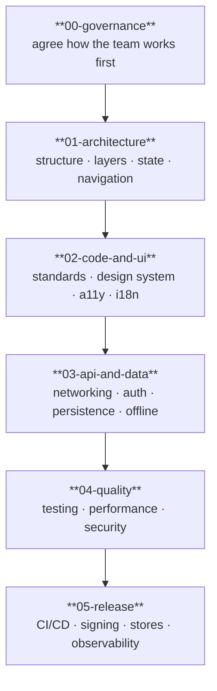

# SDD Guide — Software Design Documentation (Mobile)

> This document explains the **approach and methodology** that governs this entire repository.
> Read it first if you are new to the project or to the methodology.

---

## What is SDD?

**Software Design Documentation** is a development approach where design documentation
**precedes and guides** implementation. It is not about documenting what was already built —
it is about designing on paper before writing code.

```
Traditional:   Code  →  Documentation (if it ever happens)
SDD:           Documentation  →  Code  →  Updated documentation
```

### The 3 SDD principles

1. **Design before code:** A reviewed design document is the prerequisite for starting a feature.
2. **Living documentation:** Documentation is updated with every change. An outdated document is a bug written in prose.
3. **Traceability:** Every screen has a story; every story has acceptance criteria; every criterion has a test.

---

## Fill-in order



| Order | Section | You leave with... |
|-------|---------|-------------------|
| 1 | `00-governance` | Team agreements: git, agile, DoR/DoD, security rules |
| 2 | `01-architecture` | Decided structure, layering, state pattern, navigation, first ADRs |
| 3 | `02-code-and-ui` | Coding standards + design system, accessibility, i18n rules |
| 4 | `03-api-and-data` | How the app talks to backends and stores data offline |
| 5 | `04-quality` | Test strategy, performance budgets, security checklist |
| 6 | `05-release` | Pipeline, signing, store rollout, observability |

---

## How to work with templates

Files named `_template-*.md` are **copy-and-fill** templates. Never edit the template in place:

1. Copy the template.
2. Rename it (e.g. `_template-feature.md` → `feature-checkout.md`).
3. Fill it in; remove the instruction blocks.
4. Register it in the section `README.md` table when applicable.

---

## Adapting to your stack

Every rule here is **stack-agnostic**. Where a rule needs a concrete tool, pick one per app
and record it in an ADR (`01-architecture/decisions/`). Examples of what to pin down:

| Concern | Flutter | React Native | Native |
|---------|---------|--------------|--------|
| State | Bloc / Riverpod | Redux / Zustand | ViewModel / MVI |
| Local DB | Drift / Isar | WatermelonDB / SQLite | Room / Core Data |
| Networking | Dio | fetch / axios | URLSession / Retrofit |
| Tests | flutter_test | Jest / RNTL | XCTest / JUnit |
