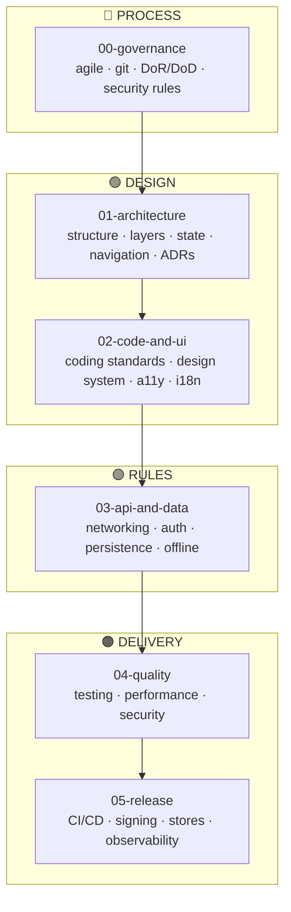

# Mobile Governance Framework

> Documentation manual and governance scaffold for **mobile applications** — stack-agnostic
> (Flutter, React Native, native iOS, native Android). A lighter companion to the
> microservices framework: the same manual-with-templates approach, fewer sections.

**Author:** [Jesus Ariel Gonzalez Bonilla](https://github.com/jesusarielgb-works)

This repository is a **documentation scaffold** for any mobile project. It contains no
project-specific information. Its purpose is to teach how to govern and document a mobile
app professionally — showing what goes in each section, why it matters, and how the
sections relate.

---

## How to use this framework

1. **Fork** (or copy the structure) into your project repository.
2. **Read** [`00-sdd-guide.md`](./00-sdd-guide.md) for the fill-in order and methodology.
3. **Read each section `README.md`** before filling in its documents — they explain what is expected.
4. **Copy the `_template-*` files** when you need to document a concrete feature, screen,
   decision, endpoint, entity, test case, or release. Fill in, rename, keep the original template.
5. **Adapt every neutral rule** to your concrete stack (Flutter / React Native / native).
6. Once a document is complete, remove the instruction blocks.

---

## Build flow — section dependencies

> `00-governance` wraps the entire project and applies to every section.

---

## Sections

| # | Section | Content |
|---|---------|---------|
| [00](./00-governance/) | Governance | Agile process, git conventions, DoR/DoD, security rules |
| [01](./01-architecture/) | Architecture | Project structure, layers, state, navigation, ADRs |
| [02](./02-code-and-ui/) | Code & UI | Coding standards, design system, accessibility, i18n |
| [03](./03-api-and-data/) | API & Data | Networking, auth, persistence, offline & sync |
| [04](./04-quality/) | Quality | Testing strategy, performance budgets, mobile security |
| [05](./05-release/) | Release | CI/CD, signing, store distribution, observability |

Companions:
[monolith-governance-framework](https://github.com/jesusarielgb-works/monolith-governance-framework) ·
[microservices-governance-framework](https://github.com/jesusarielgb-works/microservices-governance-framework)

---

## How to Cite

> Gonzalez Bonilla, J. A. (2026). *Mobile Governance Framework* (v1.0.0). jesusarielgb-works. https://github.com/jesusarielgb-works/mobile-governance-framework

## Contributing

See [CONTRIBUTING.md](CONTRIBUTING.md).

## License

MIT — Jesus Ariel Gonzalez Bonilla. See [LICENSE](LICENSE).
